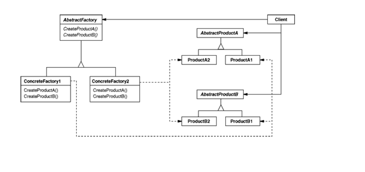

# Абстрактная фабрика (Abstract Factory)

## Предназначение
Предназначен для согласованного порождения групп взаимосвязанных и/или взаимозависимых объектов.

## Альтернативное название
Kit (набор инструментов)

## Мотивировка
Классическая мотивировка, которая приводится во всех книгах по паттернам - это необходимость создания кроссплатформленных приложений. Т.е. приложений, которые сохраняют функциональность при переходе между операционными системами, но поддерживают интерфейс, присущий той или иной операционной систсеме. Это попытка отделить бизнес-логику приложения от его интерфейсной части и задать возможность варьировать и то, и другое.

## Участники
Задача эта решается следующим образом. Состоит из двух идей:

1. **Конкретная фабрика.** Создание некоторых объектов, существующих в прорамме, делегируется не самому приложению, но специальному объекту, который называется *Фабрика*. Фабрика имеет в своем составе конструктор для вывода всего того множества взаимосвязанных и взаимозависимых объектов, которые мы упомянали в назначении паттерна.
2. **Абстрактная фабрика.** Фабрики образуют иерархию, в вершине которой находится абстрактный объект - та самая абстрактная фабрика. Все конструкторы объектов, содержащиеся в абстрактной фабрике, чисто виртуальны (абстрактны). Она просто определяет интерфейс для создания этого взаимосвзанного множества объектов. Ее наследники, конкретные фабрики, уже переопределяют эти конструкторы чтобы наполнить их реальным содержанием.

Соответственно программа содержит ссылку на абстрактную фабрику и вызовы методов, описанных в этой самой абстрактной фабрике, а в нужный момент времени конфигурирует (подставляет) вместо абстрактной фабрики нужную конкретную фабрику.

**Участники:** абстрактная фабрика, ее наследники - конкретные фабрики, клиент программы, иерархия классов, используемых в клиенте и с вызовами в точке создания соответствующих объектов (в точке уничтожения тоже) к конструкторам, содержащимся в абстрактной фабрике.

## Результат
Мы применяем абстрактную фабрику, когда хотим отделить создание, инстанциацию, конструирование, конфигурирование группы объектов от его использования. Иногда возникает требование о взаимном использовании некоторого набора объектов. Т.е. некоторые объекты могут использоваться только с некоторыми или, напротив, некоторые объекты не могут использоваться с какими-то объектами. Соответственно использование в данном случае абстрактной фабрики является приемлемым выходом из ситуации.

Очевидно, что абстрактную фабрику разумно использовать в том случае, если список объектов, присутствующих в приложении, достаточно фиксирован, а вот их варианты реализации могут отличаться (варьироваться в широких пределах), и мы предполагаем, что мы должны быть готовы в любой момент масштабировать программу, заменив один набор классов другим набором классов. Если же, напротив, мы предполагаем, что список классов будет расширяться, то в такой ситуации абстрактная фабрика, конечно же, неудобна, и нужно использовать другие паттерны. Сама идея наследования и полиморфизма - это также паттерн.

## Родственные паттерны
Очевидно, при реализации абстрактной фабрики используется паттерн *Фабричный Метод* (другое название - *Виртуальной Конструктор*). По логике вещей абстрактная фабрика в программе одна. Это носит название паттерна *Одиночка* (*Singleton*). Идея абстрактной фабрики предполагает легкость и скорость добавления новых конкретных фабрик. Соответственно кроме привычного для нас наследования здесь в качестве альтернативы может выступать паттерн *Прототип* (*Prototype*), который клонирует сам себя с целью создания новой конкретной фабрики, в который можно внести минимальные возмужные изменения для получения новой фабрики.
